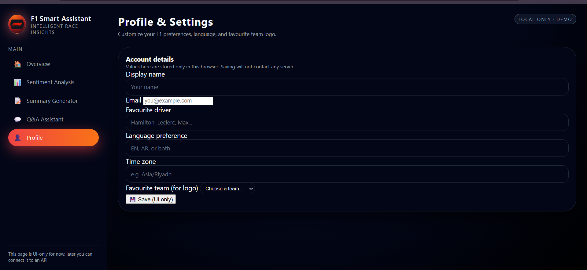
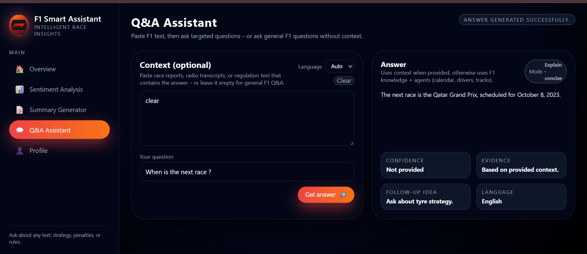
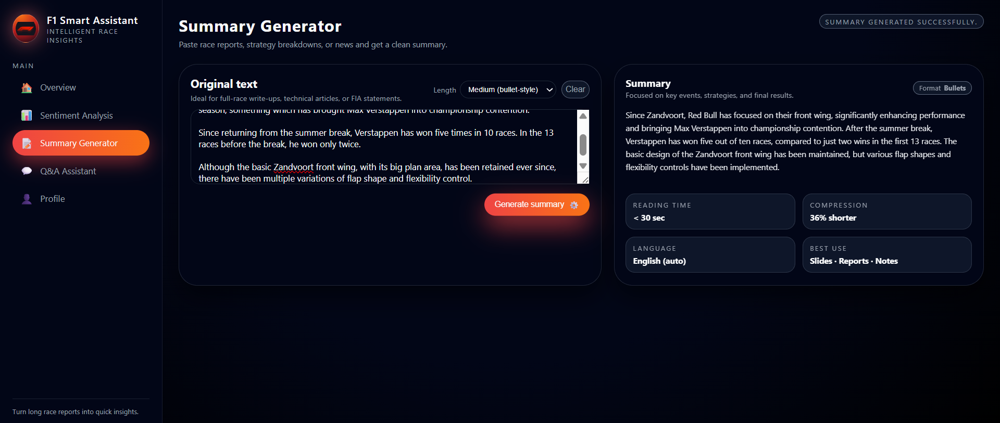

# F1 Smart Assistant  
Intelligent race insights powered by AI — including sentiment analysis, summarization, multilingual Q&A, and F1 knowledge agents.

---

## 🚀 Overview

F1 Smart Assistant is a lightweight AI-powered web application designed for Formula 1 fans.  
It allows users to analyze race commentary, summarize F1 text, and ask advanced questions using structured agents (calendar, knowledge, telemetry, sentiment, and multilingual QA).

The project integrates:

- **FastAPI** backend  
- **OpenAI API** (GPT-4o / GPT-4o-mini)  
- **Custom F1 agents** for calendar, drivers, tracks, telemetry, and race QA  
- **HTML/CSS/JS dashboard** frontend  
- **Local embeddings** for offline retrieval  
- **Full English + Arabic support**

---

## 🧠 Features

### 1. Sentiment Analysis  
Analyze tweets, radio messages, or race commentary to determine:  
- Positive  
- Neutral  
- Negative  
Includes explanation and confidence score.

### 2. Summary Generator  
Summarize race reports, technical articles, or long F1 discussions.  
Supports: short, medium, and long formats.

### 3. F1 Q&A Assistant  
Understands questions with or without context.  
Supports:
- Calendar questions (next race, last race, race location)
- Knowledge questions (drivers, tracks, nationalities)
- Race engineering questions (tyres, pitstops, strategy)
- Multilingual context answering (Arabic / English)

### 4. Multilingual Mode  
Detects language automatically.  
Supports:
- English  
- Arabic  

### 5. Agent Planner  
Routes questions to the correct agent:
- sentiment_agent  
- summary_agent  
- calendar_agent  
- knowledge_agent  
- qa_agent  
- multilingual_agent
  
## 📸 Demo






---

## 🏗️ Project Structure

f1-smart-assistant/
│
├── app/
│ ├── main.py
│ ├── agents/
│ │ ├── calendar_agent.py
│ │ ├── knowledge_agent.py
│ │ ├── nlp_agent.py
│ │ ├── planner.py
│ │ ├── qa_agent.py
│ │ ├── retriever_text.py
│ │ ├── retriever_telemetry.py
│ │ └── summarizer.py
│ ├── models/
│ │ ├── passages.json
│ │ └── telemetry_embeddings.json
│ ├── race_calendar.json
│ └── utils.py
│
├── assets/
│ ├── styles.css
│ ├── js/ai-tools.js
│ └── img/
│
├── dashboard/
│ ├── sentiment.html
│ ├── summary.html
│ ├── qa.html
│ ├── profile.html
│ └── index.html
│
├── features.html
├── about.html
├── auth.html
├── index.html
├── requirements.txt
├── package.json
└── README.md

---

## 🛠️ Installation

### 1. Clone the project

```bash
git clone https://github.com/albatoolAtm/f1-smart-assistant.git
cd f1-smart-assistant

### 2. Create virtual environment
python -m venv .venv
source .venv/Scripts/activate  # Windows

### 3. Install backend dependencies
pip install -r requirements.txt

### 4. Add your API key
OPENAI_API_KEY=your_key_here
OPENAI_MODEL=gpt-4o-mini

### 5. Run FastAPI backend
uvicorn app.main:app --reload


---
📡 API Endpoints
Sentiment

POST /api/ai/sentiment

{
  "text": "I love F1 but last race was boring",
  "language": "auto"
}

Summary

POST /api/ai/summary

{
  "text": "long text here...",
  "length": "medium"
}

Q&A

POST /api/ai/qa

{
  "question": "When is the next race?"
}
------
👩‍💻 Author & Project Lead
This project was collaboratively developed by:

Albatool Moathen – Lead Developer, System Architect, and F1 Q&A / Agents Developer

Sarah Alshareef – Telemetry & Data Modeling Specialist

Somaya Ishaaq – NLP & Sentiment Analysis Developer

🤝 Contribution

Feel free to fork the repo, submit issues, or open pull requests.

⭐ Support

If you like this project, consider giving it a star on GitHub — it really helps!
